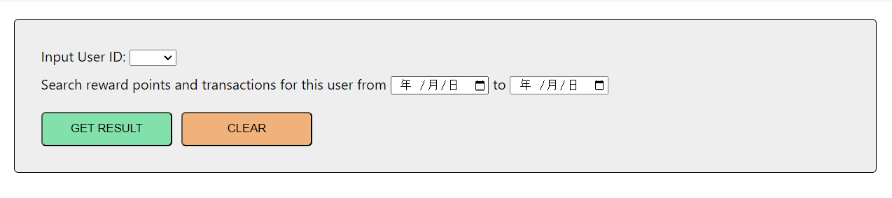
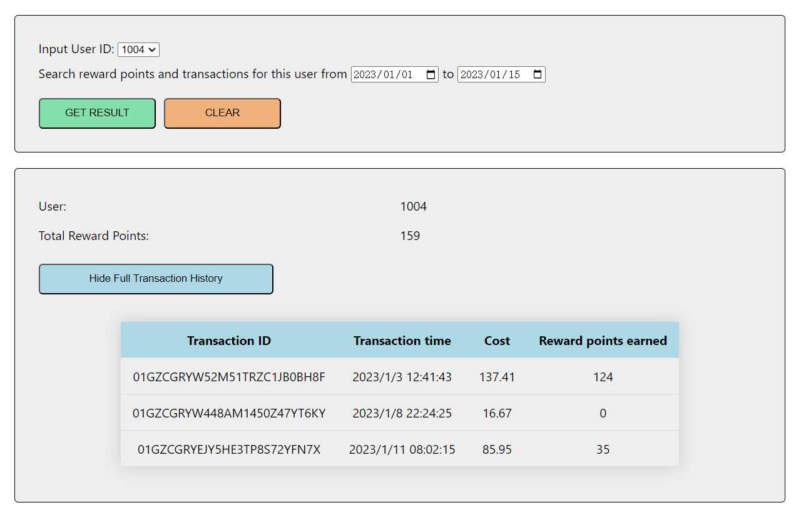

# Reward Points Application

Background: A retailer offers a rewards program to its customers, awarding points based on each recorded purchase. This is an application that can calculate the reward points and fetch all transaction history of a user.

This project was bootstrapped with [Create React App](https://github.com/facebook/create-react-app) and React version 18.2.0.

## To start the application

To run the application locally, follow these steps:

Clone the repository to your local machine.

Under the project directory, use `npm install` to install all the dependencies.

Use `npm start` to run the app in the development mode.

Open [http://localhost:3000](http://localhost:3000) to view it in your browser.

## How to use the application

This is an application that could fetch the reward points a user get from the transaction history. You can select a user from the dropdown menu, then select a time period you want to search, and get the reward points earned at this time and all transactions.

**Mock data range:
User ID is from 1001 to 1050
transactions are from 2023-01-01 to 2023-04-31**

When the application starts, you will see the following search bar. Select a user from the dropdown menu.

You can skip the time picker and get all the history transactions and all reward points when click "GET RESULT" button.

When provide a exact time period, the result will be filtered and limit to the time period.

## Author

Ted Xu
