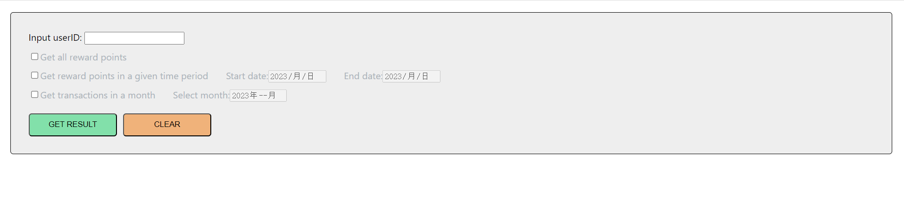
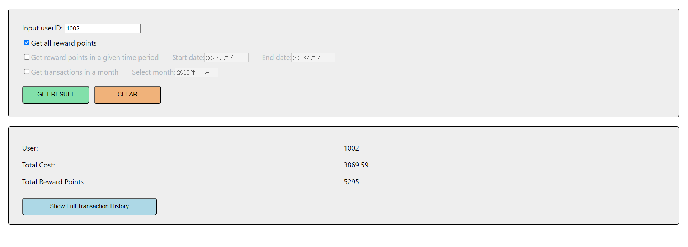
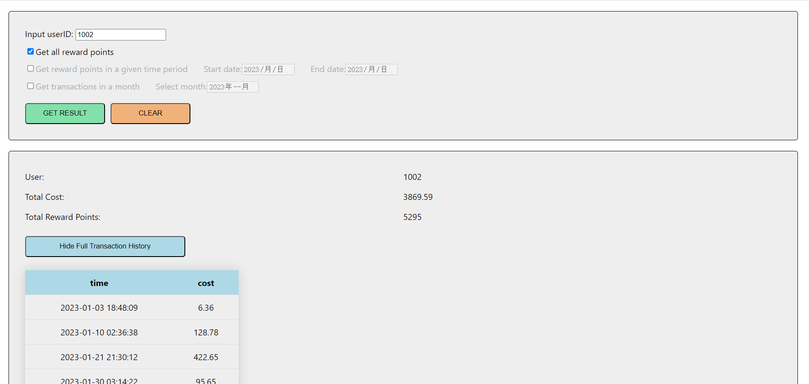

# Reward Points Application

A retailer offers a rewards program to its customers, awarding points based on each recorded purchase.

This project was bootstrapped with [Create React App](https://github.com/facebook/create-react-app) and React version 18.2.0.

## To start the application

Under the program folder, use `npm install` to install all the dependencies.

Use `npm start` to run the app in the development mode.

Open [http://localhost:3000](http://localhost:3000) to view it in your browser.

## How to use the application

This is an application that could fetch the reward points a user get from the transaction history.

It has three options:

1. Get all reward points
2. Get reward points from a given time period
3. Get reward points in a month

When the application starts, you will see the following selection bar to made your selections. First input the user ID **(Available user ID is from 1001 to 1050)**, then select a method to get data. If the information in the selection bar is available, you will see the result tab and full transaction list.

Result when given available information in the selection bar.

Full transaction list when toggle the "Show Full Transaction History" button.

